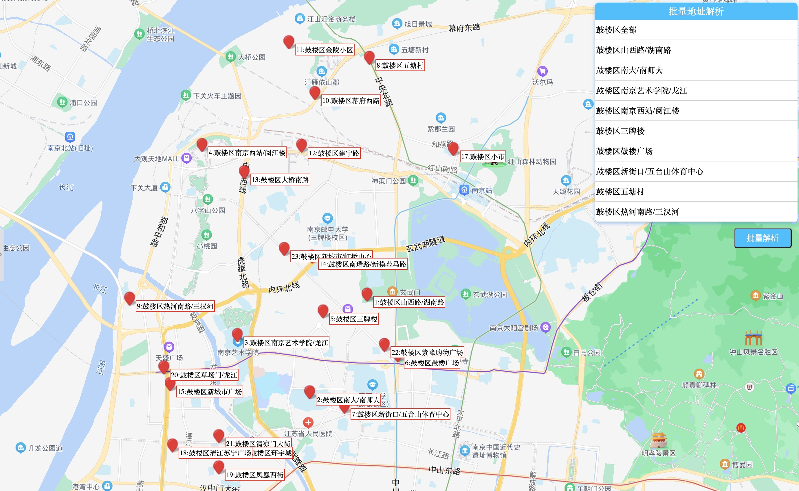

# POI 兴趣点

> 本项目中的 POI 特指美团商业兴趣点

## 背景

> 中国目前地级市 293 个、县级行政区 2844 个；其中所有地级市（包括县级单位）没有重名的；市辖区有重名但不单立
>
> 美团城市现为：1205 个（2022.08.10）；area 总数在 8000+；street 总数 30000+
>
> street poi 是单次任务的最小粒度（通过 street 查询附近店铺以及店铺数据）

### 说明

美团城市既不是严格意义上的行政区域划分（即市辖区、县级市、区县），也不是市辖区整体划分；所以一切以美团的城市划分为准（且可能有重复）

- 北京为例，在美团城市中有 2 个（非正常划分，包含且单立）：北京（市辖区，且包含了门头沟区）、门头沟区
- 苏州为例，在美团城市中有 6 个（非正常划分，分拆了旅游景区）：即苏州（市区）、常熟、太仓、昆山、张家港、周庄（昆山下辖镇）
- 扬州为例，在美团城市中有 5 个（非正常划分，分拆了市辖区）：扬州（市区）、江都（市辖区，仍然以县级市单立）、高邮（县级市）、仪征（县级市）、宝应
- 阿拉善盟为例，直接划分整区 1 个（非正常划分，合并了所有县区）：阿拉善盟（左旗、右旗、额济纳旗）

### 过滤

- 香港、澳门、台湾、冥王星、垦丁等地，因美团并未实际运营，故过滤
- 过滤区县级以下的城市如（周庄、企石镇、东坑镇、乌镇、谢岗镇）

### POI 分布（Street POI）

以美团「南京 > 鼓楼区」为例；可以看到 POI 的分布不是均匀的，距离间隔在 1 - 3 公里不等；所以在搜索店铺时，需要按照距离进行筛选


## 数据

### 数据结构

数据的层级关系

```bash
# city: 美团城市
# area: 美团城市区域
# street: 美团商业POI（大多是美图划出的高频商业 POI）
city > area > street
```

### 获取城市 & 区域 & POI

- 获取所有城市（美团）

```typescript
// 访问页面
const uri = 'https://www.meituan.com/changecity';

// puppeteer 脚本如下
await page.goto(uri);
await page.waitFor(3000);
const city = await page.evaluate(() => {
  const city = [];
  const container = document.getElementsByClassName('alphabet-city-area')[0];
  const nodes = container.getElementsByClassName('link city');
  for (let node of nodes) {
    let cityInfo = { name: '', alias: '', url: '' };
    let cityAlpha = node.parentElement.parentElement.id ?? 'city-A';
    let uri = node.href;
    cityInfo.name = node.innerHTML;
    cityInfo.alias = uri
      .replace(/(https?:)?\/\//gi, (m) => '')
      .replace(/\.meituan.com(\/)?/gi, (m) => '');
    cityInfo.alpha = cityAlpha.replace(/city-/gi, '')?.toLowerCase();
    cityInfo.url = uri;
    city.push(cityInfo);
  }
  return city;
});
```

- 获取所有城市区域（以及子区域）

```typescript
const uri = 'https://nj.meituan.com/meishi';
await page.goto(uri);
await page.waitFor(3000);
const filters = await page.evaluate(() => {
  const city = [];
  return window._appState.filters;
});

const { areas } = filters;
```

## Q&A

Q：为何不直接使用美团 H5 城市选择页的数据？
A：H5 页面（h5.waimai.meituan.com）数据是动态获取（虚列表），无法通过 DOM 获取，且城市无法查询区域&街道|商业 POI 数据

Q：合并的 Street POI 数据，如何处理（比如：南京 > 鼓楼区 > 南京艺术学院/龙江）？
A：直接合并为 「鼓楼区南京艺术学院龙江」，先查询坐标，然后再逆解析为详细地址

Q：如何保障 POI 在逆解析的正确性？
A：暂时只要求正确率（如大于 90% - 95%），不保障完全正确

Q：如何处理重复数据（如南京鼓楼区新街口 与 南京秦淮区新街口地区）？
A：不处理（后续交给大数据团队处理），本服务只挖掘数据

Q：为何城市主页，不直接 GET 获取，而是在 Puppeteer 中打开？
A：主页是懒加载逻辑，需要在真实浏览器中打开并渲染执行 JS 逻辑，才能获取到数据
